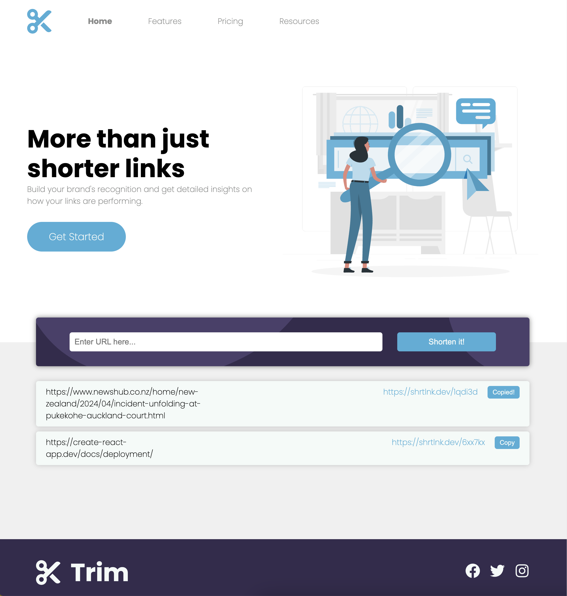

# URL Shortening Landing Page

This project is a responsive web application that enables users to shorten long URLs quickly and efficiently. Designed to adjust to any screen size, it provides an intuitive user interface that allows users to easily manage their shortened links. This README outlines the project setup, features, and instructions for getting started.

## Features
Users of the URL Shortening Landing Page can:

- **Responsive Design:** Utilizes media queries and flexible layouts to adapt to various screen sizes.
- **URL Shortening:** Integrates with the Shrtlnk API to shorten URLs provided by users.
- **Persistent Storage:** Utilizes localStorage to store shortened links locally, ensuring persistence across browser sessions.
- **Clipboard Integration:** Utilizes the Navigator Clipboard API to enable users to copy shortened URLs to their clipboard with a single click.
- **Error Handling:** Provides feedback to users in case of submission failures, such as empty input fields. Handles errors returned by the Shrtlnk API, including server errors and client-side validation errors. Recognizes limitations imposed by certain browsers, such as Safari on iOS, which may restrict clipboard access in some instances. The alternative solution of manual copying is offered.

## Tech Stack
This project leverages the following technologies:

- HTML
- CSS
- JavaScript
- React
- Axios
- Shrtlnk API

## Development Practices
Throughout development, the following practices were emphasized:

- API Integration with Axios: Utilizes Axios for making asynchronous requests to external APIs.
- Local Storage Management: Implements localStorage for persisting user-generated data locally.
- Clipboard API Integration: Incorporates the Navigator Clipboard API for interacting with the user's clipboard.
- Asynchronous Programming: Utilizes Promises, async/await, and try/catch for handling asynchronous operations.
- React Router DOM: Implements React Router DOM for managing navigation within the application.

## Getting Started
### Prerequisites
Ensure that you have npm installed on your machine. If npm is not installed, it can be obtained by installing Node.js from https://nodejs.org/.

### Setup Instructions
1. Clone the repository

2. Register for an API key: Register and obtain an API key from [Shrtlnk](https://shrtlnk.dev/developer) for URL shortening functionality.

3. Configure the API key: In the api.js file, replace API_KEY with your obtained API key:

        const API_KEY = 'YOUR_API_KEY';
4. Install dependencies:

        npm install
5. Start the development server:

        npm start
    The app will run in development mode. Open http://localhost:3000 to view it in your browser.

## Create React App

This project was bootstrapped with [Create React App](https://github.com/facebook/create-react-app).

## Available Scripts

In the project directory, you can run:

### `npm start`

Runs the app in the development mode.\
Open [http://localhost:3000](http://localhost:3000) to view it in your browser.

The page will reload when you make changes.\
You may also see any lint errors in the console.

### `npm test`

Launches the test runner in the interactive watch mode.\
See the section about [running tests](https://facebook.github.io/create-react-app/docs/running-tests) for more information.

### `npm run build`

Builds the app for production to the `build` folder.\
It correctly bundles React in production mode and optimizes the build for the best performance.

The build is minified and the filenames include the hashes.\
Your app is ready to be deployed!

See the section about [deployment](https://facebook.github.io/create-react-app/docs/deployment) for more information.

### `npm run eject`

**Note: this is a one-way operation. Once you `eject`, you can't go back!**

If you aren't satisfied with the build tool and configuration choices, you can `eject` at any time. This command will remove the single build dependency from your project.

Instead, it will copy all the configuration files and the transitive dependencies (webpack, Babel, ESLint, etc) right into your project so you have full control over them. All of the commands except `eject` will still work, but they will point to the copied scripts so you can tweak them. At this point you're on your own.

You don't have to ever use `eject`. The curated feature set is suitable for small and middle deployments, and you shouldn't feel obligated to use this feature. However we understand that this tool wouldn't be useful if you couldn't customize it when you are ready for it.

